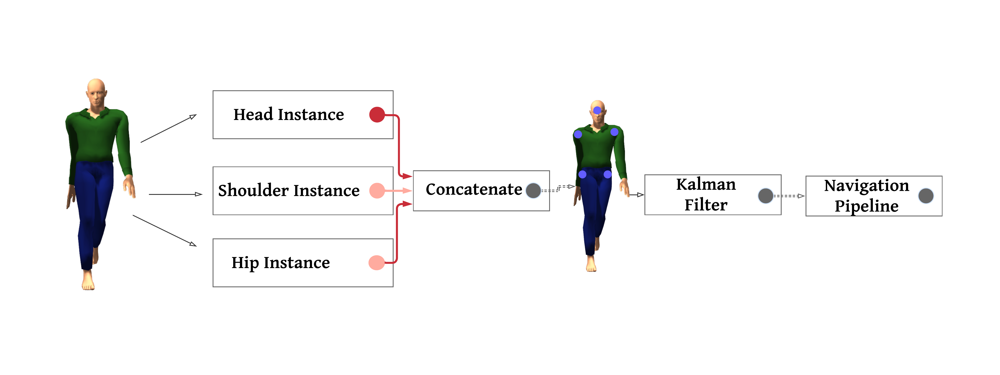
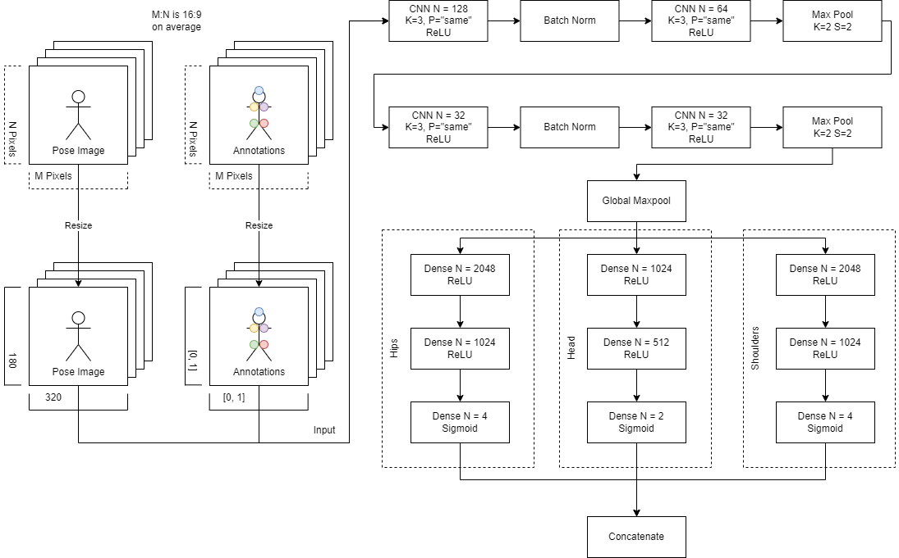
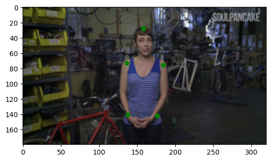
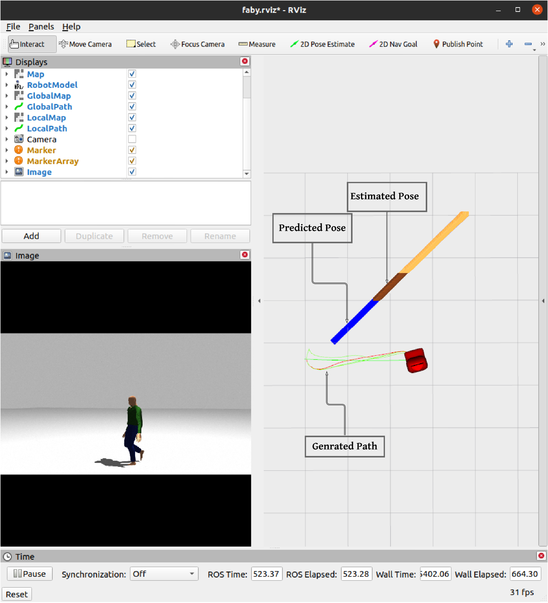

# Socially-aware-navigation

## Overview
Human pose estimation using deep learning method to predict trajectory-based intent from historical human poses using Kalman filter and utilize these predictions for socially aware navigation.

## Dataset
[**MPII Human Pose Dataset**](http://human-pose.mpi-inf.mpg.de/)

## Pipeline

  

## Model Architecture

  

## Results
### Preprocessed image with filtered annotations

  

### Model output in simulation

### Navigation

## Refrences
> [1] A plugin for simulation of human pedestrians in ROS Gazebo.
> https://github.com/robotics-upo/gazebo_sfm_plugin.
> Accessed: 2022-12-01
