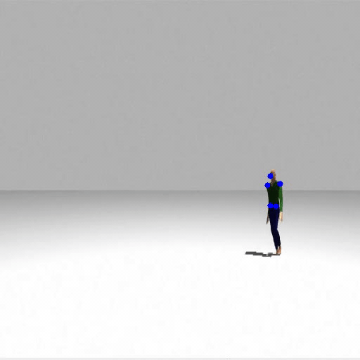

# Socially-aware-navigation

## Overview
Human pose estimation using deep learning method to predict trajectory-based intent from historical human poses using Kalman filter and utilize these predictions for socially aware navigation.

## Dataset

## Pipeline

  

## Model Architecture

  

## Results
### Preprocessed image with filtered annotations

  

### Model output in simulation

### Navigation

